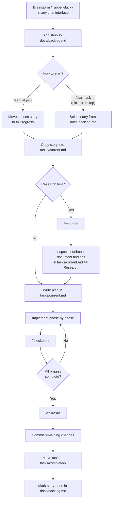

# [Project Name]

> [Short description]

An AI-assisted project template that provides a structured, repeatable workflow for working with Claude Code and Codex. It enforces research-first development, task tracking, and clean documentation habits across the entire lifecycle of a task.

## Setup

```bash
bash scripts/setup.sh
```

The setup script will prompt for project name, description, tech stack, and an optional git remote. It rewrites placeholder tokens in `CLAUDE.md` and `README.md`, creates a fresh git history, and optionally pushes to the new remote.

After setup, fill in the remaining scaffolding:

1. Edit `CLAUDE.md` -- add project conventions, architecture summary, and stack details.
2. Edit `docs/backlog.md` -- add user stories in priority order.
3. Copy any relevant skills into `.claude/skills/`.
4. Launch `claude` and run `/start-task` to begin.

## Workflow

The workflow revolves around `docs/backlog.md`. The backlog is the single intake point for all work -- every task begins as a user story there before it becomes active.

### Populating the Backlog

User stories can be generated through any chat interface (ChatGPT, Claude, Copilot Chat, etc.). Use a rubber-ducky or brainstorming conversation to think through requirements, then paste the resulting stories into `docs/backlog.md` using the standard template:

```
### US-NNN: [Story title]

**As a** [user type]
**I want** [capability]
**So that** [benefit]

**Acceptance criteria:**
- [ ] [criterion]
```

Stories are prioritised top-to-bottom in the Backlog section. When ready to start work, either:

- **Use `/start-task`** -- it reads the backlog and offers the next story from the top.
- **Pick manually** -- move any story directly into the In Progress section of the backlog, then copy it into `tasks/current.md` yourself.

Either path leads into the same implementation lifecycle: research, plan, implement, checkpoint, and wrap up.

### Task Lifecycle



### Commands

| Command | Purpose |
|---------|---------|
| `/start-task` | Read the backlog, pick the next story, populate `tasks/current.md`, and choose whether to research or plan immediately. |
| `/research` | Scan the codebase for files, patterns, and constraints relevant to the current task. Write findings into the Research section of `tasks/current.md`. No solutions proposed at this stage. |
| `/checkpoint` | Review progress against the plan, update checkboxes in `tasks/current.md`, suggest a commit message, and report context usage. Recommends compacting above 50% context. |
| `/update-references` | Regenerate `docs/scriptReferences.md` by scanning project scripts, queries, and event handlers. |
| `/wrap-up` | Commit any outstanding changes, move the completed task to `tasks/completed/`, and mark the story done in the backlog. |

### Key Principles

- **Single source of truth.** `tasks/current.md` tracks the active task -- story, research, plan, and progress.
- **Research before planning.** Understand the codebase before writing a plan. Document findings, don't skip this step.
- **Plan before coding.** Break work into phases with checkboxes. Get confirmation before implementation starts.
- **Commit after each phase.** Use `/checkpoint` to stay disciplined.
- **Clean wrap-up.** Completed tasks move to `tasks/completed/`, the backlog is updated, and script references are refreshed if needed.

## Project Structure

```
.
├── CLAUDE.md                  # Project context for Claude (stack, conventions, state)
├── AGENTS.md                  # Multi-agent workflow configuration
├── README.md                  # This file
├── docs/
│   ├── architecture.md        # System architecture overview
│   ├── backlog.md             # Prioritised user stories
│   ├── references.md          # External documentation links
│   ├── scriptReferences.md    # Auto-generated code inventory
│   └── decisions/
│       └── 000-template.md    # Architecture Decision Record template
├── tasks/
│   ├── current-template.md    # Template for tasks/current.md
│   ├── current.md             # Active task (story, research, plan, progress)
│   └── completed/             # Archive of finished tasks
├── issues/                    # Tracked issues and bugs
├── scripts/
│   └── setup.sh               # One-time project initialisation
├── .claude/
│   ├── commands/              # Slash commands (start-task, research, checkpoint, wrap-up, update-references)
│   ├── agents/                # Specialist agent prompts (architect, backlog manager, feature dev, gitops)
│   ├── skills/                # Domain-specific knowledge packs
│   └── hooks/                 # Context reminder hooks
└── .codex/
    ├── commands/              # Mirrored commands for Codex
    ├── agents/                # Mirrored agent prompts
    ├── skills/                # Mirrored skills
    └── hooks/                 # Mirrored hooks
```

## Specialist Agents

The template includes agent prompts in `.claude/agents/` for tasks that benefit from focused expertise:

| Agent | Use Case |
|-------|----------|
| `technical-architect` | System design, technology evaluation, risk assessment |
| `product-backlog-manager` | Writing user stories, defining acceptance criteria, prioritisation |
| `python-feature-dev` | Implementing Python features from specs or requirements |
| `k8s-gitops-architect` | Kubernetes manifests, Helm charts, Kustomize, ArgoCD/Flux |

## Model Guidance

- **Default:** Use Opus for planning and Sonnet for implementation.
- **Escalate** to Opus with extended thinking for complex debugging or architectural decisions.
- **Compact** at 50% context usage to maintain quality.
